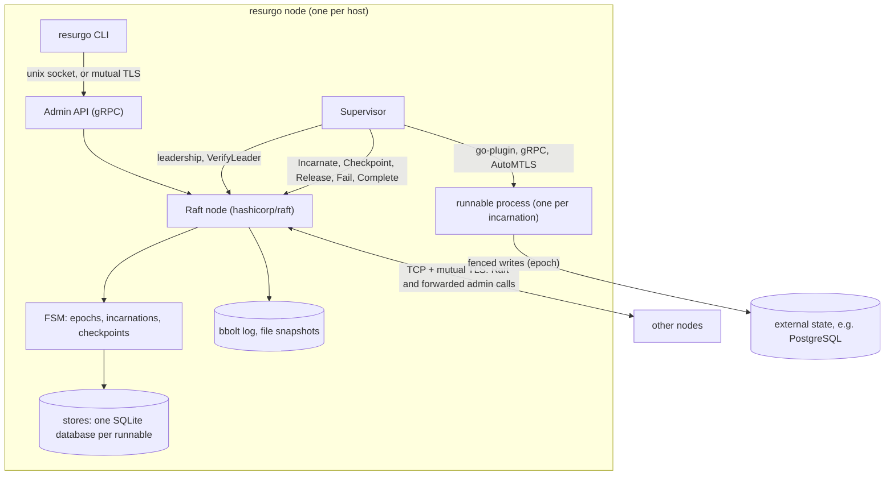

The components of a node (the architecture guide's introduction).

```mermaid
flowchart TB
  subgraph node["resurgo node (one per host)"]
    CLI["resurgo CLI"] -->|"unix socket, or mutual TLS"| ADM["Admin API (gRPC)"]
    ADM --> RN["Raft node (hashicorp/raft)"]
    RN --> FSM["FSM: epochs, incarnations, checkpoints"]
    FSM --> ST[("stores: one SQLite database per runnable")]
    RN --> LOG[("bbolt log, file snapshots")]
    SUP["Supervisor"] -->|"leadership, VerifyLeader"| RN
    SUP -->|"Incarnate, Checkpoint, Release, Fail, Complete"| RN
    SUP -->|"go-plugin, gRPC, AutoMTLS"| P1["runnable process (one per incarnation)"]
  end
  RN <-->|"TCP + mutual TLS: Raft and forwarded admin calls"| PEERS["other nodes"]
  P1 -->|"fenced writes (epoch)"| EXT[("external state, e.g. PostgreSQL")]
```
